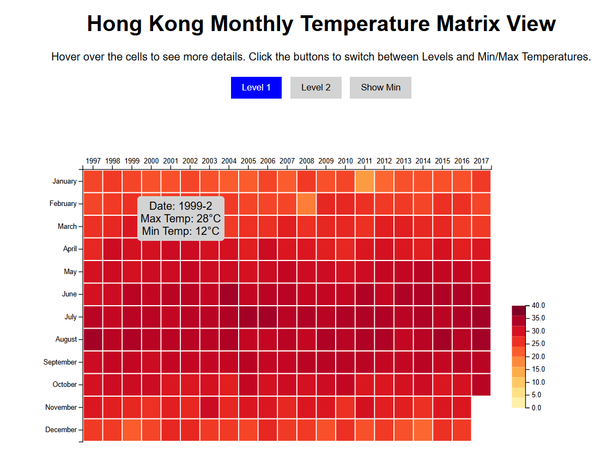
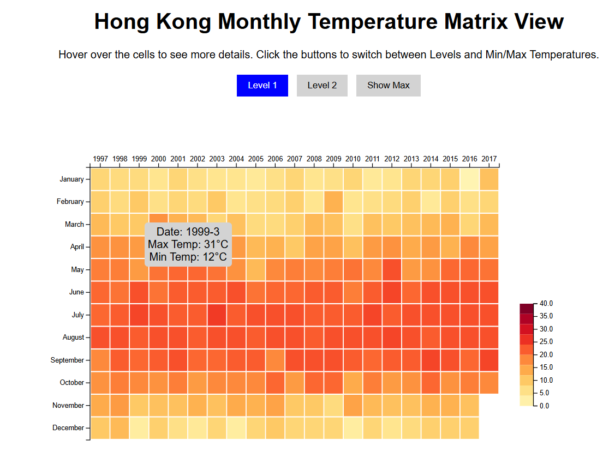
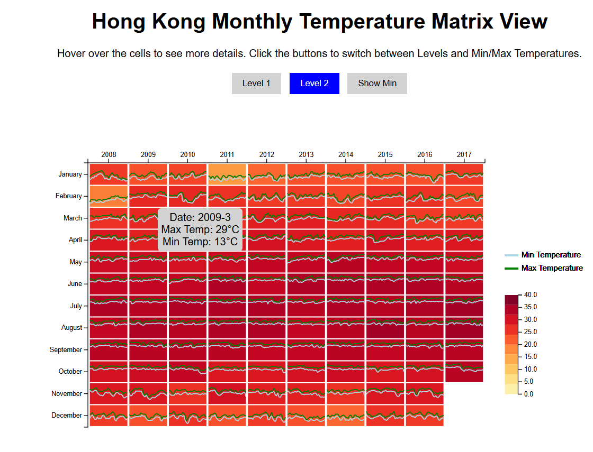
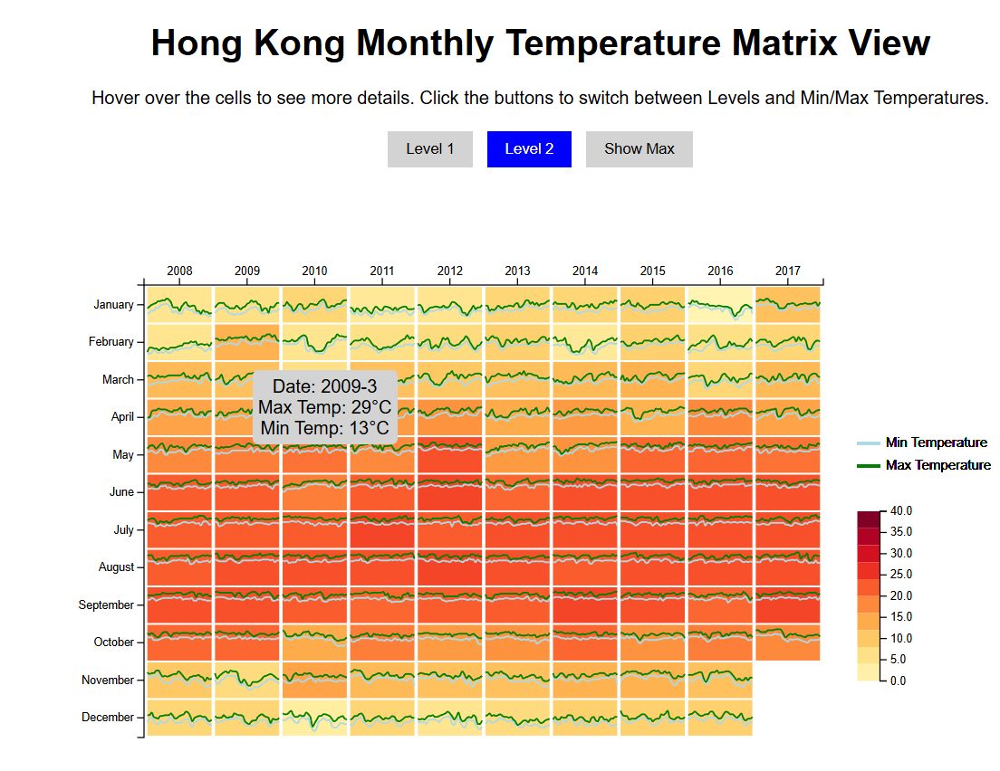

## Hong Kong Monthly Temperature Visualization

There are 2 levels to this visualization and buttons were added to toggle between the levels.

### Level 1 : Year/Month Heatmap

In this level, added a Matrix View to visualize the Monthly Temperature of Hong Kong, where the color of each matrix cell encodes the temperature.
The dataset used is uploaded as temperature_daily.csv.

Key features -
1. In the matrix, x direction indicates the year and y direction indicates the month. Each cell indicates the corresponding month of a specific year.
2. Added color to each cell visualizing the maximum and minimum temperature by month. A button can be clicked to switch between the visualizations for Min and Max.
3. When the mouse pointer is hovered on any cell, a tooltip would appear showing the date(Year-Month), min and max temperature values.
4. A legend showing the mapping between colors and values was also added.

   
   
    
     <em>Level 1 - Max Temp Visualization</em>
      
   
    
     <em>Level 1 - Min Temp Visualization</em>

### Level 2 : Improved Year/Month Heatmap

In this level, even within each month, the daily trends of max and min temperatues are shown. Focused only on the last 10 years of data for this level. 

Key features -
1. Same as level 1, x direction indicates the year and y direction indicates the month. Each cell indicates the corresponding month of a specific year.
2. Still same as level 1, added color to each cell such that it represents the monthly Max/Min temperatures.
3. In the mini line charts within each cell, x direction represents the days in a month, and y direction represents the temperature
4. A legend to show the mapping between colors and values was also added.

  
   
    
     <em>Level 2 - Max Temp Visualization</em>
      
   
    
     <em>Level 2 - Min Temp Visualization</em>
   

### To run the code -
1. Download this repo and unzip the folder.
2. In a terminal, navigate to the downloaded folder and run the command "python -m http.server 8000"
3. In a web broswer, give "http://localhost:8000/".
